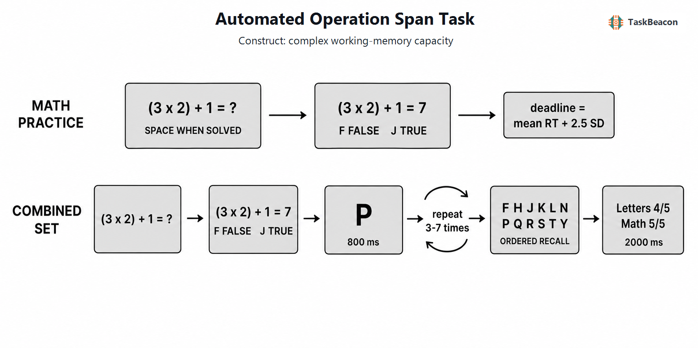

# Automated Operation Span Task
| Field | Value |
|---|---|
| Name | Automated Operation Span Task |
| Version | 0.1.0 |
| Date Updated | 2026-07-12 |
| PsyFlow Version | current local runtime |
| PsychoPy Version | current local runtime |
| Modality | Behavioral |
| Language | English |

## 1. Task Overview
Automated OSPAN measures complex working-memory capacity by interleaving arithmetic verification with serial letter storage. The main task contains 15 randomized sets: set sizes 3-7 appear three times each, totaling 75 letters and operations.

## 2. Task Flow



### Block-Level Flow
Instruction -> math practice/deadline calibration -> three combined size-2 practice sets -> 15 scored sets -> summary.

### Trial-Level Flow
Within each set, solve operation -> judge proposed answer -> view letter for 800 ms, repeated by set size, then recall letters in serial order and view 2000-ms feedback.

### Controller Logic
Math practice response times set the subsequent verification deadline to mean + 2.5 SD, bounded from 1 to 10 seconds.

### Other Logic
Absolute span sums perfectly recalled set sizes; total correct counts letters recalled in the correct serial position. Math accuracy below 85% invalidates interpretation.

## 3. Configuration Summary

### a. Subject Info
| Field | Constraint |
|---|---|
| Participant ID | Three digits |

### b. Window Settings
| Setting | Value |
|---|---|
| Resolution | 1280 x 800 |
| Units | Degrees |

### c. Stimuli
| Stage | Content |
|---|---|
| Operation | Simple integer multiplication plus/minus term |
| Verification | Proposed result, F false/J true |
| Storage | One of F H J K L N P Q R S T Y |
| Recall | Two-row letter matrix and serial position |

### d. Timing
| Stage | Duration |
|---|---:|
| Letter | 800 ms |
| Feedback | 2000 ms |
| Recall | 30 s ceiling per letter |

### Triggers
Operation, verification, letter, recall, feedback, response, timeout, and boundaries have dedicated codes.

## 4. Methods (for academic publication)
Participants completed an automated operation-span task adapted from Unsworth et al. (2005). After arithmetic practice established an individualized verification deadline, participants completed three set-size-2 combined practice sets and 15 scored sets. Scored set sizes 3 through 7 each occurred three times in randomized order. Each item required solving an operation, judging a proposed answer with F=False or J=True, and retaining a letter shown for 800 ms. At set end, letters were recalled in serial order. Absolute span and position-wise total correct were computed, with scores flagged invalid below 85% arithmetic accuracy.

## Running
```powershell
python main.py human --config config/config.yaml
python main.py qa --config config/config_qa.yaml
python main.py sim --config config/config_sampler_sim.yaml
```
